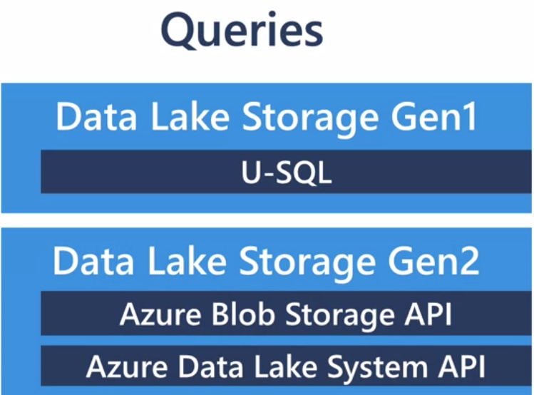

# 🏹 Tools in Azure

## Azure Cosmos DB

Fully managed NoSQL.

## Databricks&#x20;

Data analytic platform

## Spark&#x20;

Large scale SQL, batch processing, Stream processing, and machine learning.

## Azure Data Factory

Execute Transform , extract, and final load.&#x20;

## Azure Synapse Analytics

Provide big data engineering services

## IOT (Internet of Things)

### Azure Storage&#x20;

1. Azure Blob(Text and binary data)
2. Azure Files(Manage file shares)
3. Azure Queue(a messaging store for messaging between application components)
4. Azure Table(No sql and structured data)

**Azure Blob Store**(cheapest way if no need to query the data)

* REST APIs
* SDKs for Azure Storage
* Supported languages

You can use Azure Cloud Shell, Azure Powershell, Azure CLI.

### Data Ingest

1. Azure Data Factory
2. Storage Explorer
3. AzCopy tool
4. PowerShell
5. Visual Studio

When you upload a file more than 2GB, use PowerShell, Visual Studio. it also automatically split data over 200GB.

#### You can't query your data from Blob directly. you have to move it into Azure storage account, or data lake storage.

Azure storage account uses **Azure Resource Manager (Role based access contro**l) for all the data.

## Azure Data Lake Storage

It is Hadoop compatible data repository and can store any size or type data.

Data gen 1 can't upgrade to gen 2, and because it uses access control based on the role, so it is easy to control the data access.

<figure><figcaption></figcaption></figure>

## Azure Cosmos DB

It supports some APIs:

<figure><figcaption></figcaption></figure>

&#x20;The benefit of Azure Cosmos DB

1. Uptime (99.999%)
2. Replication&#x20;

If there is a regional disaster, it will automatically copy over.&#x20;

3. Consistency.&#x20;

## Azure Synapse Analytics

<pre class="language-markdown"><code class="lang-markdown">## Azure Blob Storage - Basic Information

For scenarios where there's no need to query data, **Azure Blob Storage** presents a cost-effective option:

- **Accessibility**: Access blobs using REST APIs or SDKs across various programming languages.
- **Integration Tools**: Utilize tools like Azure Cloud Shell, Azure Powershell, and Azure CLI to manage your storage.

### Data Ingestion Methods

To move data into Azure Blob Storage, consider the following methods:

1. **Azure Data Factory**: For data integration service, orchestrating and automating data movement and data transformation.
2. **Storage Explorer**: A graphical tool to manage Azure Storage accounts and access your blobs.
3. **AzCopy**: A command-line utility designed to copy data to/from Azure Blob Storage, File Storage, and Table Storage.
4. **PowerShell**: Leverage Azure Storage PowerShell module commands for data transfer tasks.
5. **Visual Studio**: Integrate Azure storage solutions into your development environment for a streamlined experience.

#### Large File Handling

For files larger than 2GB:
- Opt for PowerShell or Visual Studio to handle uploads efficiently.
- These methods automatically handle the splitting of data chunks over 200GB.

#### Data Querying Limitation

To perform query operations on your blob data, it must first be moved to an Azure Storage account or Azure Data Lake Storage.

## Azure Data Lake Storage - Overview

Azure Data Lake Storage provides:

- **Hadoop Compatibility**: A scalable repository for big data analytics workloads.
- **Data Storage**: Ability to store large volumes of data in any format.
- **Data Security**: Utilize Azure Resource Manager and Role-Based Access Control (RBAC) to manage access to your data.

Note that Azure Data Lake Storage Gen1 cannot be upgraded directly to Gen2.

## Azure Cosmos DB - Features

Azure Cosmos DB is known for:

1. **High Availability**: Guarantees an uptime of 99.999%, ensuring data is always accessible.
2. **Global Replication**: In the event of a regional disaster, Azure Cosmos DB provides automatic failover to a replica.
3. **Consistency Levels**: Offers a range of consistency options to balance between performance and data accuracy.

## Azure Synapse Analytics

(<a data-footnote-ref href="#user-content-fn-1">Insert Azure Synapse Analytics specific content here.)</a>

</code></pre>

[^1]: definition&#x20;
